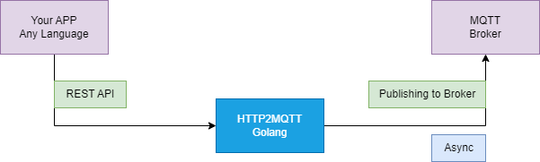
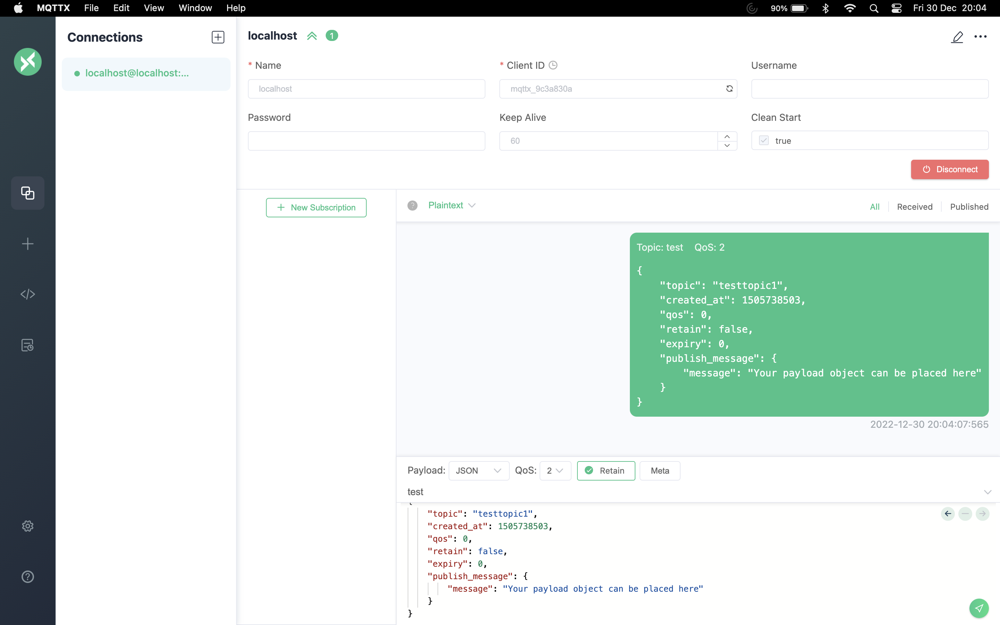

# Go MQTT Publisher

## How it works



This is a simple MQTT client written in Go. It demonstrates the basic functionality of connecting to an MQTT broker, subscribing to a topic, and publishing messages to a topic.

## Prerequisites

Before you begin, make sure you have the following dependencies are installed:

- Go (version 1.18 or higher)
- MQTT broker (such as Mosquitto)
- MQTTX Client (Optional)

## Installing

To install the `go-mqtt-publisher` client, clone the repository and build the binary:

### Clone
```
git clone https://github.com/azep-engineering/go-mqtt-publisher.git
```

### Config Update
- `cd go-mqtt-publisher`

- `config/mqtt.yaml`
	- Update broker IP under `brokers`
```
#ClienyID  
client_id: “CLIENT-NAME”
brokers:  
- “XX.XX.XX.XX:1883" 
 
username: ""
password: "" 

ping_timeout: 2 #ping timeout in seconds  
max_reconnect_interval: 5 #max reconnect interval  
connect_timeout: 5 #max reconnect interval
```
### Build
- `go mod tidy`
-  `go build`


## Usage
By calling below API, We can be able to publish messages to MQTT broker.

### API Overview

| Method| Endpoint|
|---|---|
|POST|  `http://localhost:8002/v1/publish` |

___

### Request

```json
{
    "topic": "testtopic1",
    "created_at": 1505738503,
    "qos": 0,
    "retain": false,
    "expiry": 0,
    "publish_message": {
        "message": "Your payload object can be placed here"
    }
}
```

### Response

```json
{
    "error": false,
    "message": "success",
    "data": {
        "header": {
            "topic": "testtopic1",
            "version": 1,
            "created_at": 1505738503,
            "message_id": 1672405536498542000
        },
        "body": {
            "message": "Your payload object can be placed here"
        }
    }
}
```

---

## Verification Steps

MQTTX provides a simple interface for publishing messages to MQTT topics and subscribing to receive messages from topics.



### To Install MQTTX Follow link below

https://mqttx.app/docs/downloading-and-installation

---
