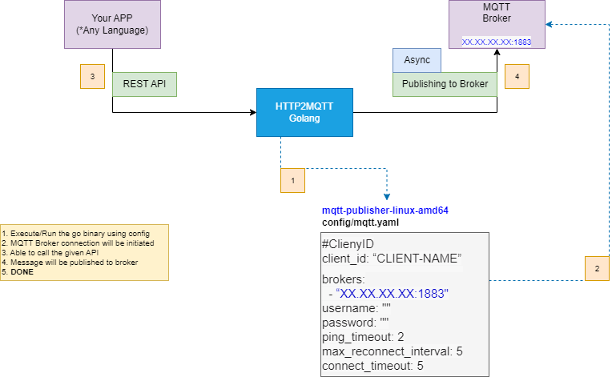

# AZEP MQTT Publisher - API Documentation

## How it work



This is a simple MQTT client written in Go. It demonstrates the basic functionality of connecting to an MQTT broker, subscribing to a topic, and publishing messages to a topic.

## Prerequisites

Before you begin, make sure you have the following dependencies installed:

- Go (version 1.18 or higher)
- An MQTT broker (such as Mosquitto)

## Installing

To install the MQTT client, clone the repository and build the binary:

```git clone https://github.com/<username>/azep-mqtt-publisher.git
cd azep-mqtt-publisher
go build
```

- Copy code

## Usage

To use the MQTT client, run the binary with and check in MQTTX or Postman:

---

## Using MQTTX

To test the MQTT client using MQTTX, you will need to have MQTTX installed on your machine.

### To Install MQTTX Follow link below

https://mqttx.app/docs/downloading-and-installation

### After Install Follow

- Open MQTTX and click on the "New Connection" button.
Enter the URL of the MQTT broker you want to connect to in the "Server" field (e.g. tcp://localhost:1883).
- Enter a name for the connection in the "Client ID" field (e.g. "mqtt-client-go").
- Click on the "Connect" button to establish a connection to the MQTT broker.
- Once connected, you can subscribe to the topic you specified in the MQTT client by clicking on the "Subscribe" button and entering the topic name in the "Topic" field.
- To publish a message to the topic, click on the "Publish" button and enter the topic name and message in the appropriate fields.
- The MQTT client should receive the message and print it to the console.

```text
Note: You may need to configure the MQTT client to use the same client ID as the one you entered in MQTTX in order for the client to receive the message. You can do this by adding a `clientid` flag to the command line arguments when running the MQTT client.
```

## Using Postman

### API Overview

| Environment | Base-URL |
|---|---|
|Local|  `localhost:8002/v1/publish` |

### Endpoints

#### MQTT Notification Service

| Description | Endpoints | Method | StatusCode | Sign |
|---|---|---|---|---|
|Publish MQTT Notification| /v1/publish | POST | 200 |  [Sign](#MQTT)

___

## API

Endpoint : `/v1/publish`

Method : `POST`

StatusCode : `200`

---

### `Request`

#### MQTT Publish

Request

```json
{
    "topic": "testtopic1",
    "created_at": 1505738503,
    "qos": 0,
    "retain": false,
    "expiry": 0,
    "publish_message": {
        "message": "Your payload object can be placed here"
    }
}
```

Response

```json
{
    "error": false,
    "message": "success",
    "data": {
        "header": {
            "topic": "testtopic1",
            "version": 1,
            "created_at": 1505738503,
            "message_id": 1672405536498542000
        },
        "body": {
            "message": "Your payload object can be placed here"
        }
    }
}
```
